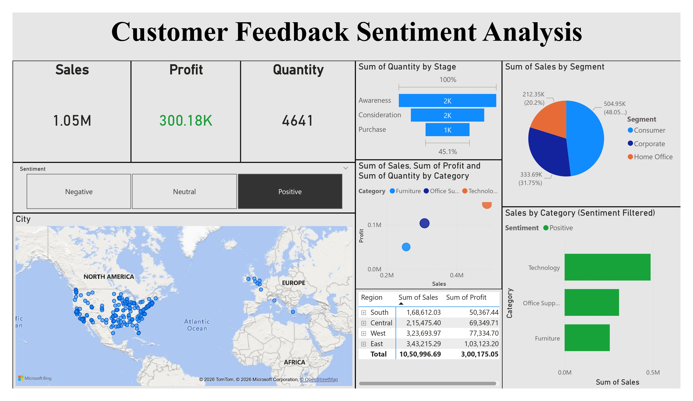
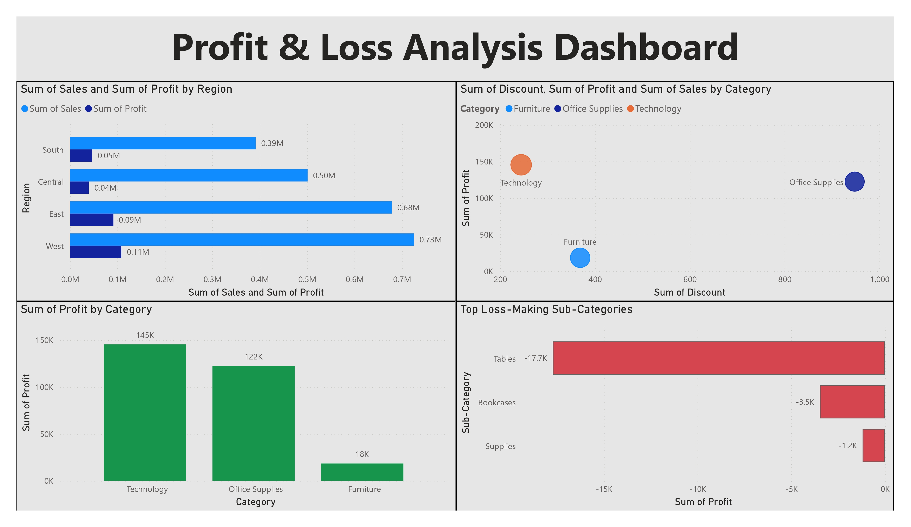

# 📊 Customer Feedback Sentiment Analysis Dashboard

> An interactive **Power BI Dashboard** that combines customer sentiment analysis with sales and profitability metrics to support data-driven business decisions.

---

## 🖼️ Dashboard Preview

| Page 1 – Customer Sentiment Overview | Page 2 – Profit & Loss Analysis |
|:---:|:---:|
|  |  |

---

## 📌 Problem Statement

Organizations receive large volumes of customer feedback but lack tools to connect sentiment with actual business performance. Manual analysis is slow, inconsistent, and fails to surface loss-making areas in time for effective decision-making.

**Key challenges this project addresses:**
- No visibility into customer sentiment (Positive / Neutral / Negative)
- Difficulty identifying loss-making products, sub-categories, and regions
- No clear link between discount strategies and profitability
- Lack of an accessible, interactive tool for non-technical users

---

## ✅ Solution Overview

A **two-page interactive Power BI Dashboard** built on the Sample Superstore dataset, enabling sentiment-filtered analysis of sales, profit, and customer behavior.

### Page 1 — Customer Sentiment Overview
- KPI Cards: Total Sales (`1.05M`), Total Profit (`300.18K`), Total Quantity (`4,641`)
- Sentiment Slicer (Positive / Neutral / Negative)
- Bing Map — geographic sales distribution by city
- Scatter Plot — Sales vs. Profit by Category
- Regional Sales Table (South, Central, West, East)
- Pie Chart — Customer Segments (Consumer, Corporate, Home Office)
- Funnel Chart — Quantity by Stage (Awareness → Consideration → Purchase)
- Bar Chart — Category Sales filtered by Sentiment

### Page 2 — Profit & Loss Analysis
- Horizontal Bar Chart — Sales vs. Profit by Region
- Scatter Plot — Discount vs. Profit by Category
- Bar Chart — Profit by Category (Technology: `145K` | Office Supplies: `122K` | Furniture: `18K`)
- Loss Chart — Top Loss-Making Sub-Categories:

  | Sub-Category | Profit |
  |---|---|
  | Tables | −17.7K |
  | Bookcases | −3.5K |
  | Supplies | −1.2K |

---

## ✨ Features

| Feature | Description |
|---|---|
| 🔘 Sentiment Slicer | Filters all visuals dynamically — no technical knowledge required |
| 📦 KPI Cards | Instant snapshot of Sales, Profit, and Quantity |
| 🗺️ Map Visualization | Bubble map showing sales volume across cities and regions |
| 📉 Scatter Plot | Reveals discount-profit correlation at the category level |
| 🟢🔴 Conditional Formatting | Green = Profit, Red = Loss — applied consistently throughout |
| 🏷️ Loss Sub-Category Chart | Ranks top loss-making sub-categories to prioritize action |
| 🥧 Segment Pie Chart | Breaks revenue down by Consumer, Corporate, and Home Office |
| 📊 Regional Comparison | Side-by-side Sales vs. Profit bars across all four regions |

---

## 🛠️ Tech Stack

| Tool | Purpose |
|---|---|
| **Power BI Desktop** | Dashboard design, data modeling, and interactive visualizations |
| **Sample Superstore** | Retail dataset — Sales, Profit, Discount, Region, Category, Sub-Category |
| **DAX** | Calculated measures: Total Sales, Total Profit, Total Quantity |
| **Bing Maps** | Geographic sales distribution visual |

---

## 📁 Repository Structure

```
📦 customer-feedback-sentiment-dashboard
 ┣ 📂 screenshots
 ┃ ┣ 🖼️ page1.jpg          # Customer Sentiment Overview
 ┃ ┗ 🖼️ page2.jpg          # Profit & Loss Analysis
 ┣ 📂 dataset
 ┃ ┗ 📄 Sample_Superstore.xlsx
 ┣ 📄 CustomerFeedback_Dashboard.pbix   # Main Power BI file
 ┣ 📄 Project_Report.docx
 ┗ 📄 README.md
```

---

## 🚀 Getting Started

### Prerequisites
- [Power BI Desktop](https://powerbi.microsoft.com/desktop/) (free download)

### Steps
1. **Clone the repository**
   ```bash
   git clone https://github.com/your-username/customer-feedback-sentiment-dashboard.git
   cd customer-feedback-sentiment-dashboard
   ```
2. **Open the dashboard**  
   Launch `CustomerFeedback_Dashboard.pbix` in Power BI Desktop.

3. **Explore the data**  
   Use the **Sentiment Slicer** on Page 1 to filter visuals by Positive, Neutral, or Negative feedback.

4. **Analyze losses**  
   Navigate to **Page 2** to view regional profit comparison and the top loss-making sub-categories.

---

## 💡 Unique Highlights

- 🔗 **Sentiment + Business Data Combined** — connects customer feedback directly with sales and profit metrics
- 🏗️ **Dual-Page Architecture** — overview vs. deep analysis, reducing cognitive load
- 🎯 **Proactive Loss Identification** — quantifies and ranks negative contributors
- 🎨 **Clean, Color-Coded Design** — consistent green/red profit-loss scheme for instant readability
- 👥 **Non-Technical Friendly** — fully interactive with no SQL or coding needed

---

## 🔮 Future Improvements

- [ ] Real-time database integration for live dashboard refresh
- [ ] AI/NLP-based automatic sentiment classification
- [ ] Additional slicers — Region, Category, Time Period (Year/Month/Quarter)
- [ ] Predictive analytics using Power BI forecasting or Azure ML
- [ ] Mobile-optimized responsive layout

---

## 📄 License

This project is for academic and educational purposes.

---

## 🙋‍♂️ Author

**Anshuman Dev**  
📧 anshumandev1101@gmail.com  
🔗 [LinkedIn](https://linkedin.com/in/anshumandev1101/) | [GitHub](https://github.com/anshhh1101)

---

> ⭐ If you found this project helpful, consider giving it a star!
